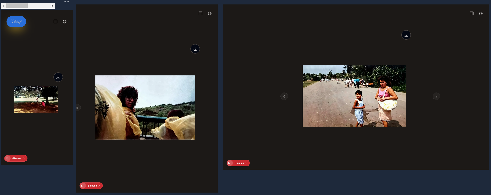
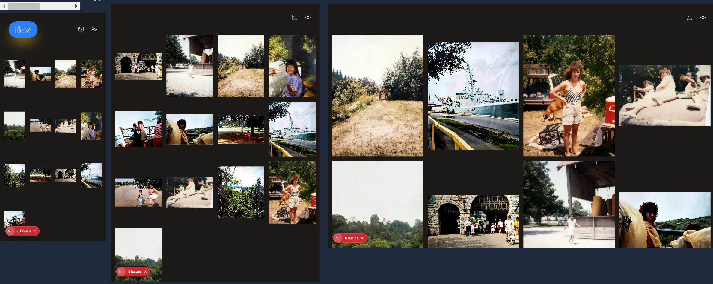

_Snowballs are blowing, Christmas elves are dancing..._ Uuugh - I totally hate winter, but it's also coming up to **Christmas**! That tradtional time of the year where you use your skills to craft apps your buddies never asked for. _Come on, it can't just be me!_

Anyway I had a leg up this year. My dad was hospitalized for a few months, so I went through the house, giving it a thorough clean and inspected every nook and cranny.

I had an _awesome_ break from this 'cope by cleaning' psychosis, where I discovered photo albums full of my family's past vacations. I had meant to send them to my dad then, but _I-don't-know-what-happened_. :woman_shrugging:

Fortunately, I can use them now to create a web app photo gallery, while learning too.

And not just any one, but a performant photo gallery, while using **[Next.js](https://nextjs.org)**, **[Cloudinary](https://cloudinary.com/pages/)**, and **[ShadCN](https://ui.shadcn.com/)**.

## Tech Stack 🧰

After weighing the pros and cons, I decided to use NextJS to optimize images. 

Tailwind is used for ease of styling and Shadcn for the carousel and tootips.  

Rather than setting up a database I decided to take advantage of Cloudinary.


<br>


## Overview

Home Page

Grid Route


When users (my dad and me) come to the home page, they are greeted with an accessible carousel. They can download each image in the best format for their device, and switch the view and light/dark mode.

For fun, the gallery line-up is randomized each time.

## Links

Check out the [repo](https://github.com/JoleneKearse/oldtimey-kearse-vacations).

And the [live site](https://oldtimey-kearse-vacations.vercel.app/).

## Getting Started

First, run the development server:

```bash
pnpm dev
```

Open [http://localhost:3000](http://localhost:3000) with your browser to see the result.

## Challenges

### Making Cloudinary images downloadable

**Cloudinary** is simply easy to use, but that's a two-edged sword. Since it can do so much, it was initially challenging to find the *exact* functionality I wanted. 

I wanted a button to download images and fortunately it was as easy as modifying the url with `upload/fl_attachment,f_auto,q_auto/` rather than just `upload/i8`. I tossed that in a utility function & slapped it into an `onClick`.  Bang boom done!

### Getting my photos to shuffle ASAP

I built my trusty `lib/photoUtils/shufflePhotos` function, which worked fantastic in _development_, but had this strange quirk where it always started with the same photo in _production_!

After plenty of _Huh_?!?s, I learned a new thing about **Next JS**. My Gallery and Grid components were served **client-side**. This meant I was only calling `getPhotos` and `shufflePhotos` once per build. So, it was getting _baked into_ the HTML. 🤦‍♀️

Enter this very cool line:

```javascript
export const dynamic = "force-dynamic";
```

This disables static optimization, making my shuffle run on every request. 🙌

While I was tempted to apply this to my `/grid` route, I abstained to make it easier to locate photos for download.
